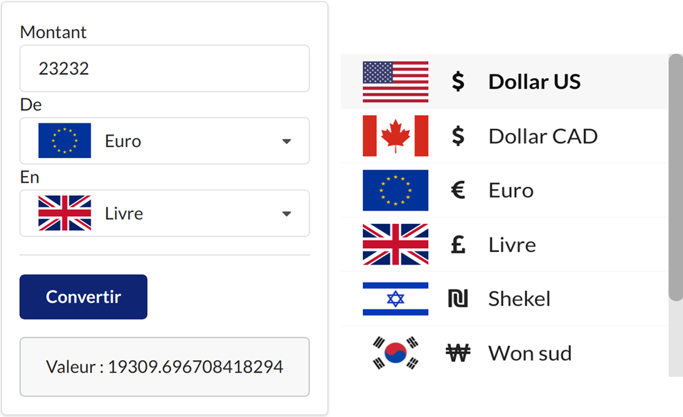
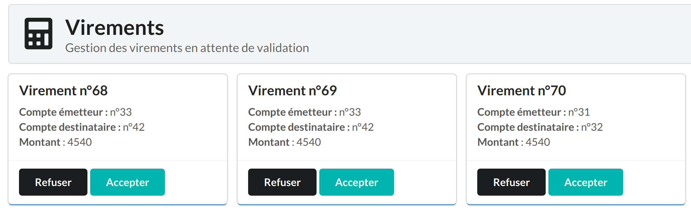

**Binome** : Mélissa Perreymond & Samy Djama <br>
Le dépot github de Samy : https://github.com/domtox/app_bank_projet_2021

# appbank : Une application bancaire fullstack sping-boot / react / keycloak


Il s'agit d'un projet universitaire en binôme dont le but est de fournir une API back d'application bancaire à un frontend. 

`appbank` est constituée d'un **Spring-Boot** Rest API `appbank-api `, et d'un frontend en **ReactJS**  `appbank-webui` sécurisé avec **keycloak**. La base de donnée utilisée pour l'API backend et celle de keycloak est **MySql**. La gestion de la base de donnée de l'API peut être faite depuis **adminer**.


(PS : La version avec l'intégration de [Mobioos](https://forge.mobioos.ai/) ne sera pas disponible sur le git) <br>
(PPS : La sécurisation de l'API est en cours de construction puisqu'elle n'est pas le sujet du projet...)

## Prérequis

- `Java 11.0.11`
- `Tomcat 9.0.54`
- `Maven 3.6.3`
- `Node 14.18.1`
- `npm 6.14.15`
- `Docker 20.10.7` 
- `Docker-Compose 1.25.0`

## Lancer l'environnement

Les ports utilisés sont : 8000, 8080, 9000 et 3000. Veuillez à ce qu'aucun de ces ports ne soient déjà utilisés avant de lancer les différents services. 

- Ouvrir le terminal et aller au dossier appbank 
- Lancer le script de démarrage  :
```
$./start.sh
``` 
Ce script lancera la base de donnée de l'API Rest et celle de keycloak. 

## Initialiser keycloak

Il vous faudra pour le premier lancement initialiser keycloak et monter la base de données.

- L'accès à keycloak se fera à l'adresse ``http://localhost:8000``. Si vous venez de lancer le script start.sh, il se peut que vous devez attendre quelques secondes avant de pouvoir voir l'interface de keycloak.

- Une fois la page ouverte, aller dans ``administration console``, et s'authentifier avec : <br>
**Username** : admin <br>
**Password** : admin <br>

- Mettre le curseur de la souris sur ``master``. Il devrait apparaître l'option ``add realms``. Ajouter le realms "**appbank**", puis appuyer sur ``create``.

- Afin d'importer les différents rôles, un fichier **realm-export.json** est inclus dans le dossier appbank. Sur Keycloak, cliquer donc sur ``import`` -> ``select file`` -> puis sélectionner le fichier **realm-export.json**. 

- Dans ``if resource exists``, mettez sur ``skip``. Finaliser l'import en cliquant sur ``import``. 

**Identity provider**

De nombreux sites intègrent à leur login la possibilité de s'inscrire et se connecter en utilisant les informations de connexion existantes d'un réseau social. Keycloak intègre également cette possibilité. Pour rajouter un réseau social à partir duquel se connecter, il faut aller dans ``identity provider``, puis ``add provider``. Vous aurez la liste des réseaux sociaux que gèrent keycloak.


Exemple pour **Github** :
- Pour **Github** : sélectionner dans la liste ``github``. Avant de cliquer sur ``save``, il faudra indiquer le client secret suivant (le code client étant déjà importé grâce au fichier **realm-export.json**) :
> **CLIENT SECRET : 868357bd5cd2edb17b798ea24e155a96c6045fb5**
- Puis, il faudra cliquer sur ``save``.

Il est tout à fait possible d'intégrer de nouveaux providers avec la même manipualtion, en récupérant au préalable le client id et le client secret via l'api du réseau social en question.

**Création et modification de users** 

La base de données de keycloak sera initialement vide. Pour tester les différentes fonctionnalités, vous devriez au moins créer un utilisateur administrateur, et un client. 

- Pour se faire, aller dans ``users`` puis ``create user``. Le rôle de l'**admin** sera ``appbank-admin`` et celui du **client** sera ``default-roles-appbank``. 

Vous pouvez à tout moment modifier vos users dans l'onglet ``users``, puis en cliquant sur ``view all users``. Vous pourrez alors éditer tous vos utilisateurs déjà crées, et notamment modifier leur rôle en cliquant sur ``edit`` puis sur ``available roles``.

## Exécuter appbank avec Maven & Npm

**appbank-api**
- Ouvrir le terminal et aller au dossier appbank/appbank-api
- Lancer la commande **maven** : 
```
$./mvnw spring-boot:run
```
**appbank-webui**
- Ouvrir le terminal et aller au dossier appbank/appbank-webui
- Si c'est la première fois que vous exécutez appbank-webui, lancez la commande **npm**:
```
$npm i
```
- Lancer la commande **npm**:
```
$npm start run
```
## Stopper l'environnement

- Ouvrir le terminal et aller au dossier appbank 
- Lancer le script de démarrage  :
```
$./stop.sh
```
- Vous pouvez vérifier que le stop s'est bien passé en lançant la commande dans ce même dossier : 
```
$docker ps -a
```
- L'affichage ne devrait afficher **aucun** container :
```
CONTAINER ID   IMAGE     COMMAND   CREATED   STATUS    PORTS     NAMES
```
- Si ce n'est pas le cas, vous pouvez toujours lancer la commande :
```
$docker system prune
```

## Adminer
Adminer permet de visualiser et gérer la base de données de l'API. On y accède avec l'adresse  ``http://localhost:9000``
L'authentification se fait avec : 
- **Système** : MySQL
- **Serveur** : mysql-appbank
- **Utilisateur**: melissa
- **Mot de passe** : changeme
- **Base de données** : appbank

Toutes ces données peuvent être modifiés et personnaliser dans le fichier ``appbank/docker-compose.yaml``.

## Keycloak 
La base de données de keycloak utilisé pour l'authentification est accessible depuis l'adresse  ``http://localhost:8000``.

L'authentification se fait depuis ``Administration Console`` avec :
- **Username** : admin
- **Password** : admin

## Interface utilisateur
Le site web est accessible depuis l'adresse ``http.//localhost:3000``. Afin d'accéder aux différents services, vous devez vous authentifier en tant qu'utilisateur client ou administrateur. Veuillez alors vous reporter à la base de donnée utilisateur dans keycloak, accessible depuis ``administration console``. Pour y accéder, veuillez vous authentifier, puis dans le menu latérale gauche, cliquez sur ``users``, puis ``View all users``.

## Vue commune à chaque type d'utilisateur

- Chaque utilisateur peut accéder au service d'authentification de keycloak en cliquant sur ``se connecter``.
- Une fois connecté, l'utilisateur peut accéder au service de conversion de devises. 



Les taux de changes sont récupérés via des requêtes au ``Currency Converter API`` (https://www.currencyconverterapi.com/). 

**Ajout et retrait de money dans le convertisseur de devises**

La liste des moneys disponibles peuvent être récupérer via => https://free.currconv.com/api/v7/currencies?apiKey=d6a00977ad323a7dc798 <br>
L'ajout et le retrait de moneys sont simples. Il suffit de rajouter ou retirer des élements du tableaux **currencies** dans ``appbank-webui/pages/CurrencyConverter.js``. La value de l'élement est ``PHP_`` suivi du code de monnaie internationale.

```
text: 'Dollar US',
icon: 'dollar',
image: '/assets/images/logo-usa.jpg',
value: 'PHP_USD',
 ```
 
## Vue client
- Dans son **home**, le client voit son nom, son adresse mail, et le nombre de comptes qu'il possède.

- Dans l'onglet **comptes**, le client peut retirer et déposer de l'argent sur ses comptes. Les retraits ne sont un succès que s'il a le droit de retirer, i.e. qu'il ne retire pas plus d'argent qu'il n'en ai, à moins que l'administrateur lui ait autorisé sur son compte d'être à découvert. Le solde est mis à jour.


- Dans l'onglet **virement**, l'utilisateur peut envoyer de l'argent depuis l'un de ses comptes vers l'un des comptes de la banque (dont les siens). Le virement est alors mis en attente et doit être validé par l'administrateur.


## Vue administrateur
- Dans son **home**, l'administrateur voit son nom, le nombre d'utilisateurs et de comptes sur la banque. L'administrateur n'a pas de compte à la banque. 

- Dans l'onglet **comptes**, l'administrateur a accès à un dashboard où il peut avoir accès et modifier les comptes bancaires et comptes utilisateurs.


- Dans l'onglet **virement**, l’administrateur a accès à la liste des virements en attente de validation. Il peut alors accepter ou refuser le virement. Après sa décision, le virement sera supprimé de la liste en attente. En cas d'**acceptation**, les soldes du compte émetteur et destinataire sont mis à jour dans la condition où l'émetteur a effectivement le droit de retirer. 




